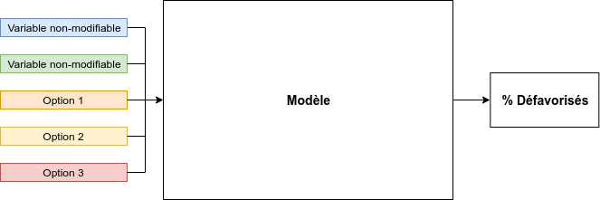
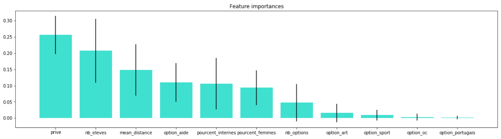

# #DataTerr - Défi n°1 - Mixité sociale

## Objectif
L'objectif poursuivit par l'équipe est l'amélioration d'un indice de mixité sociale scolaire. Pour cela il a été développé un model prédictif permettant de modéliser les changements des indicateurs PCS (catégories sociaux professionnelles) induits par des déplacements d'options entre établissements scolaires.

## Cartographie
Nous avons utilisé QGIS pour explorer les données. Nous nous sommes focalisés sur la ville de Bordeaux car nous disposions des données de carte scolaire. Chaque établissement est représenté par ses indicateurs PCS, le nombre d'élève de secteur non présent dans l'établissement, l'indicateur PCS_D (catégories sociaux professionnelles défavorisées) prédit par notre modèle, et enfin l'indicateur PCS_D après déplacement d'options. Nous avions pour idée de développer également une aide à la modification des cartes scolaires non réalisée faute de temps.

Les résultats de nos travaux de cartographie sont disponibles dans le dossier `Carto`. Le dossier `viz` contient aussi des tests de visualisation interactifs en Javascript que nous n'avons malheureusement pas pu terminer.

## Modélisation
Le notebook utilisé pour développer le modèle se situe dans le dossier `model`. Le modèle choisi pour notre example est un régresseur à base de forêts aléatoires. La variable à prédire est donc le taux d'élèves en PCS très défavorisé et les variables d'entrée sont le nombre d'élèves, secteur/privé, le nombre d'options disponibles, et les options d'intérêt.

Malgré la simplicité de cette sélection de variables, le modèle a une erreur RMSE de 2%, ce qui est très faible.
Ci-dessous la hiérarchisation automatique des variables utilisées par le modèle :

